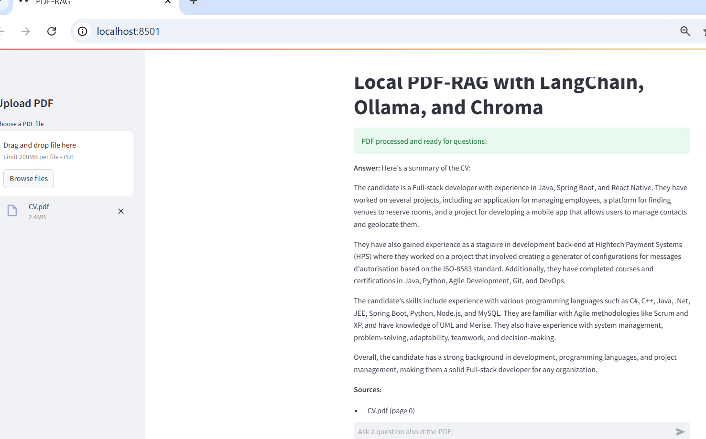
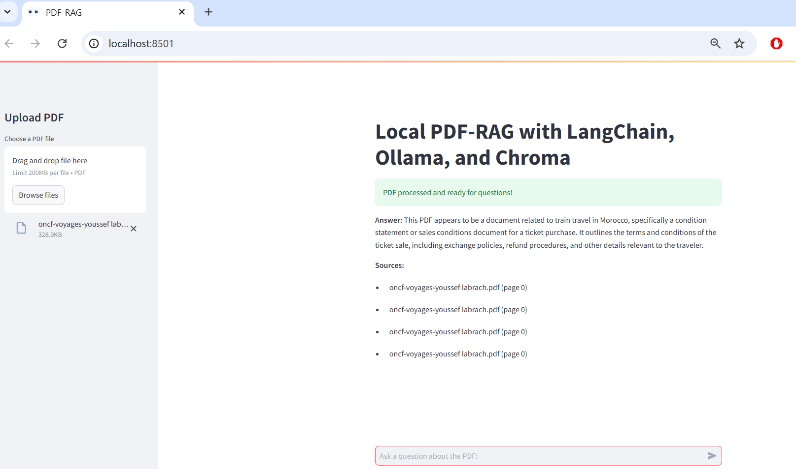

# Projet-ML-DL
# PDF-RAG with LangChain, Ollama, and Chroma

## 📄 Project Description

This project implements a **PDF Retrieval-Augmented Generation (RAG)** system using LangChain, Ollama, and ChromaDB. It allows users to upload PDF files, process their content using language models and embeddings, and ask natural language questions about the PDF.

### Key Features:
- Upload and process PDF files.
- Extract text from PDFs using LangChain's `PyPDFLoader`.
- Split documents into manageable chunks for processing.
- Embed the text using Hugging Face embeddings.
- Store and retrieve embeddings using ChromaDB.
- Generate answers to user queries using Ollama language models.
- Display source documents and metadata for generated answers.

---

## 👥 Team Members

LABRACH Youssef
ROUKNY Anas
ELYASSAA Abdeljalil
EL-HAFID Asmaa
KARKOURI Walid
SENHAJI Abdelghani

---

## 📸 Screenshots

### Example 1: CV PDF
Below is an example of processing a CV PDF and querying its contents:

### Example 2: Train Ticket PDF
Here is an example of processing a train ticket PDF and querying its contents:

---

## 🚀 How to Run the Project

### Prerequisites
- Python 3.10
- Dependencies (install using the command below):
  pip install streamlit langchain-community langchain chromadb transformers torch torchvision sentence-transformers pypdf
